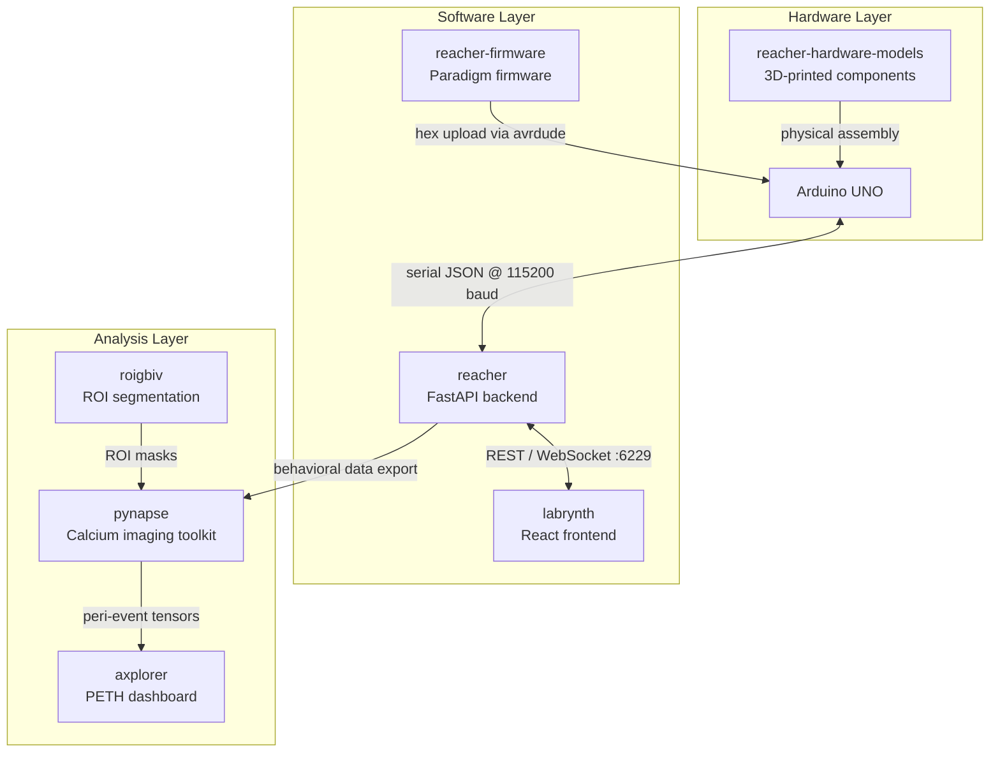

# Phoxel Workbench — Platform Overview

[](https://github.com/thejoshbq/phoxel-workbench)
[](https://www.python.org)
[](LICENSE)
[]()

**Open-source hardware, firmware, and software for head-fixed mouse operant conditioning with two-photon calcium imaging**

Phoxel Workbench is a collection of 7 free and open-source tools that together form an end-to-end platform for running behavioral experiments on head-fixed mice while simultaneously capturing neural activity via two-photon imaging. It covers everything from 3D-printable hardware and Arduino firmware, through real-time experiment control, to post-hoc calcium imaging analysis and visualization.

*Written by*: Joshua Boquiren

[](https://github.com/thejoshbq)

---

## Architecture



The **Hardware Layer** provides printable mechanical components and an Arduino UNO running paradigm firmware. The **Software Layer** handles real-time experiment control: the firmware communicates over serial JSON with the Python backend, which in turn serves a browser-based GUI. The **Analysis Layer** takes exported behavioral and imaging data through ROI segmentation, signal preprocessing, and peri-event neural analysis.

---

## Repository Overview

| Repository | Description | Tech Stack | Status |
|:-----------|:------------|:-----------|:-------|
| [reacher-firmware](https://github.com/Otis-Lab-MUSC/reacher-firmware) | Arduino paradigm firmware with 5 operant conditioning schedules | C++ / Arduino | Stable v2.0.0 |
| [reacher](https://github.com/Otis-Lab-MUSC/reacher) | FastAPI backend, serial kernel, and session manager | Python / FastAPI | Stable v2.0.0 |
| [labrynth](https://github.com/Otis-Lab-MUSC/labrynth) | Browser-based experiment control GUI | React 19 / TypeScript | Stable v2.0.0 |
| [pynapse](https://github.com/Otis-Lab-MUSC/pynapse) | Calcium imaging analysis toolkit | Python / NumPy | Alpha v0.1.0 |
| [axplorer](https://github.com/Otis-Lab-MUSC/axplorer) | Peri-event analysis and visualization dashboard | Python / Plotly.js | In Progress |
| [roigbiv](https://github.com/Otis-Lab-MUSC/roigbiv) | ROI segmentation via Cellpose fine-tuning | Python / Cellpose / CUDA | In Progress |
| [reacher-hardware-models](https://github.com/Otis-Lab-MUSC/reacher-hardware-models) | 3D-printable hardware for head-fixed rigs | STL / Arduino | Stable v1.0.0 |

---

## Experimental Workflow

1. **BUILD** — 3D-print mechanical components from `reacher-hardware-models` (levers, head fixation, syringe pump)
2. **WIRE** — Connect the Arduino UNO to reward devices, levers, and lick sensors
3. **FLASH** — Upload paradigm firmware to the Arduino via `labrynth`
4. **CONFIGURE** — Set session parameters (animal ID, paradigm, schedule values) in the browser GUI
5. **RUN** — Execute the behavioral session alongside two-photon calcium imaging
6. **EXPORT** — Save behavioral event logs and imaging data from the session
7. **SEGMENT** — Run `roigbiv` to identify ROIs in two-photon TIFF stacks
8. **ANALYZE** — Load behavioral and neural data into `axplorer` for peri-event analysis

---

## reacher-firmware

Arduino firmware powering the behavioral paradigms on the REACHER rig.

- **5 paradigms**: Fixed Ratio (FR), Progressive Ratio (PR), Variable Interval (VI), Omission, and Pavlovian
- **REACHERDevices library** for abstracted hardware control (levers, pumps, lick sensors, cue lights)
- **Scheduler engine** for non-blocking, millisecond-precision event timing
- **JSON serial protocol** for bidirectional communication with the Python backend
- **Pre-compiled `.hex` binaries** for flash-and-go deployment without the Arduino IDE

Tech: C++ / Arduino

[View on GitHub](https://github.com/Otis-Lab-MUSC/reacher-firmware)

---

## reacher

Python backend serving as the bridge between Arduino hardware and the browser UI.

- **FastAPI REST API** on port 6229 for session management, hardware control, and data export
- **WebSocket streaming** for real-time event delivery to the frontend
- **3-thread serial kernel** (reader, writer, heartbeat) for reliable Arduino communication
- **SessionManager** with port locking for coordinating multiple simultaneous sessions
- **FirmwareUploader** for flashing `.hex` files to Arduinos via `avrdude`
- **71-command registry** covering all experiment control operations

Tech: Python / FastAPI / pyserial

[View on GitHub](https://github.com/Otis-Lab-MUSC/reacher)

---

## labrynth

Browser-based GUI for configuring, running, and monitoring REACHER experiments.

- **React 19 + TypeScript** single-page application
- **5 panels**: Monitor, Session, Hardware, Program, and Data
- **6 color themes** for user preference
- **PyInstaller packaging** bundles the backend + frontend into a standalone desktop app
- **Firmware git submodule** for automatic paradigm updates
- **InnoSetup Windows installer** for one-click deployment

Tech: React 19 / TypeScript / Vite

[View on GitHub](https://github.com/Otis-Lab-MUSC/labrynth)

---

## pynapse

Toolkit for preprocessing and analyzing two-photon calcium imaging data aligned to behavioral events.

- **Sample / Population / Project** hierarchy for organizing imaging datasets
- **Preprocessing pipeline**: DFOverF, ZScore, GaussianSmoothing, and custom transforms
- **Peri-event tensor extraction** aligned to behavioral timestamps
- **Event parsing** from REACHER session logs
- **Clustering and visualization** utilities

Tech: Python / NumPy / SciPy

[View on GitHub](https://github.com/Otis-Lab-MUSC/pynapse)

---

## axplorer *(In Progress)*

Interactive dashboard for peri-event time histogram (PETH) computation and neural response analysis.

- **PETH computation** from pynapse tensors
- **Response classification** (excited, inhibited, non-responsive)
- **Behavioral summaries** and session-level statistics
- **Population-level analysis** across animals and conditions
- **Plotly.js dashboard** for interactive exploration
- **Multi-format export**: PNG, SVG, PDF, CSV, HDF5

Tech: Python / Plotly.js

[View on GitHub](https://github.com/Otis-Lab-MUSC/axplorer)

---

## roigbiv *(In Progress)*

ROI segmentation pipeline using fine-tuned Cellpose models for two-photon imaging data.

- **Cellpose fine-tuning** from the `cyto3` base model
- **Astrocyte identification** alongside neuronal ROIs
- **TIFF image and mask pipeline** for batch processing
- **CUDA / GPU support** for accelerated inference

Tech: Python / Cellpose / PyTorch

[View on GitHub](https://github.com/Otis-Lab-MUSC/roigbiv)

---

## reacher-hardware-models

3D-printable STL files and Arduino sketches for building a complete head-fixed behavioral rig.

- **~25 STL files** across 6 categories: levers, surgery tools, syringe pump, ethernet components, head fixation, and enclosures
- **Arduino pump control sketch** for syringe-based liquid reward delivery
- **Printing specs** and material recommendations

Tech: STL / Arduino

[View on GitHub](https://github.com/Otis-Lab-MUSC/reacher-hardware-models)

---

## Getting Started

### Path A: Running Experiments

Download the standalone installer from the [labrynth releases page](https://github.com/Otis-Lab-MUSC/labrynth/releases). The installer bundles the Python backend, React frontend, and firmware binaries into a single desktop application — no development environment required.

### Path B: Development

```bash
# Clone the repositories you need
git clone https://github.com/Otis-Lab-MUSC/reacher.git
git clone https://github.com/Otis-Lab-MUSC/labrynth.git
git clone https://github.com/Otis-Lab-MUSC/reacher-firmware.git

# Install the Python backend
cd reacher
pip install -e .

# Build the frontend
cd ../labrynth
npm install
npm run build
```

---

## Prerequisites

| Requirement | Version | Used By |
|:------------|:--------|:--------|
| Python | 3.10+ | reacher, pynapse, axplorer, roigbiv |
| Node.js | 18+ | labrynth |
| Arduino CLI / avrdude | Latest | reacher (firmware uploads) |
| CUDA | 11.8+ (optional) | roigbiv (GPU-accelerated segmentation) |
| 3D Printer | FDM / resin | reacher-hardware-models |

---

## License

All Phoxel Workbench repositories are released under the [MIT License](LICENSE). See individual repository LICENSE files for details.

---

## Contact

Joshua Boquiren — [thejoshbq@proton.me](mailto:thejoshbq@proton.me)

GitHub Organization: [Otis-Lab-MUSC](https://github.com/Otis-Lab-MUSC)
